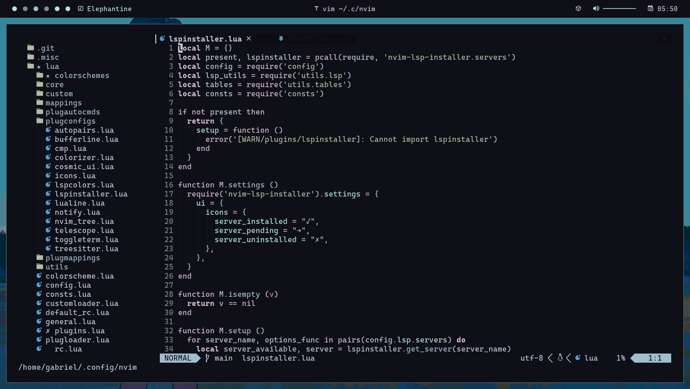

<div align="center">
    
    <h1>Levuaska for NeoVim</h1>
    <p></p>
    <a href="https://github.com/levuaska/levuaska.nvim/stargazers">
        
    </a>
    <a href="https://github.com/levuaska/levuaska.nvim/network/members/">
        
    <a href="https://github.com/levuaska/levuaska.nvim">
    	
    </a>
    <a href="https://github.com/levuaska/levuaska.nvim/blob/main/LICENSE">
    	
    </a>
</div>
<hr>

</img>

## External Plugin Support

- Telescope
- Nvim Tree
- Tresitter
- Lsp
- Lsp saga
- Coc
- Bufferline
- Illuminate
- Diff
- Git signs
- Git gutter
- Lualine
- Indent-BlankLine

## Installation

You can install this plugin with packer:

```lua
use { 'levuaska/levuaska.nvim', as = 'levuaska' }
```

Or with vim-plug:

```vim
Plug 'levuaska/levuaska.nvim', { 'as': 'levuaska' }
```

## Active theme

To active the theme call this in your neovim config:

```lua
local levuaska = require('levuaska')

levuaska.setup({ nvim_tree = { contrast = true } }) -- or use contrast = false to not apply contrast
```

Or with vim script:

```vim
colorscheme levuaska
```

> It will set automatically the `vim.opt.termguicolors` to true

## Activating lualine theme

Place this in your lualine config:

```lua
local lualine = require('lualine')

lualine.setup {
  options = {
    theme = 'levuaska',
  },
}
```

## Using the core to get the colors

If you want to get the colors into a lua dictionary

```lua
local levuaska = require('levuaska.core')
local colors = levuaska.get_colors()
```

<h2>Thanks</h2>

- [AlphaTechnolog](https://github.com/AlphaTechnolog)
